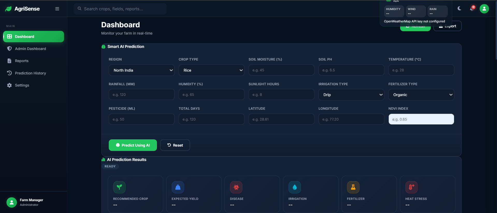
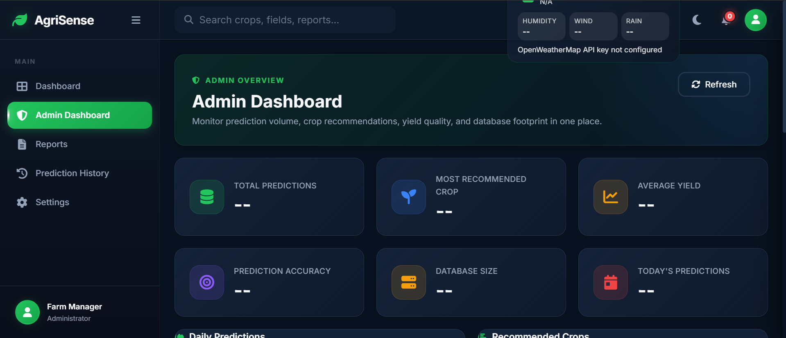
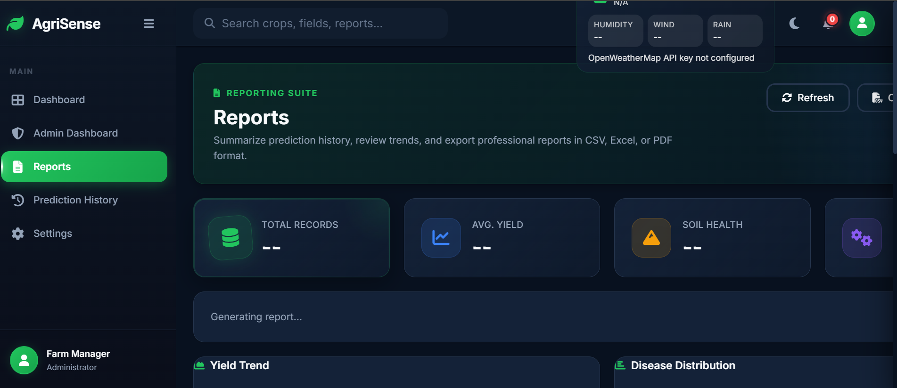
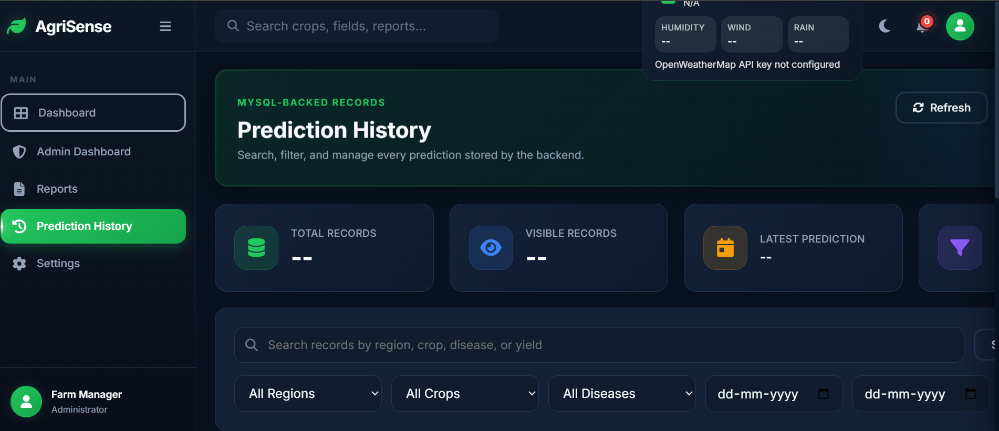
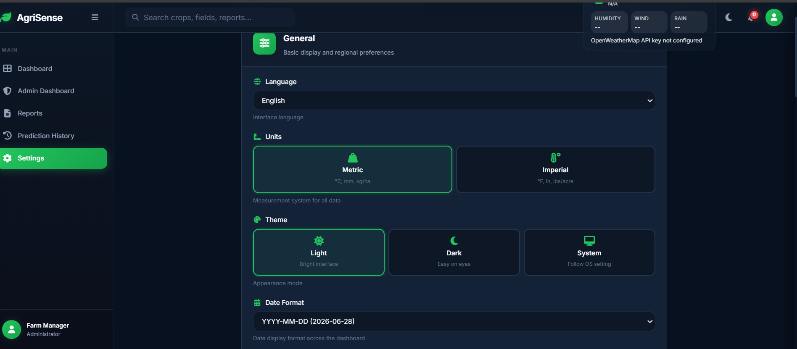
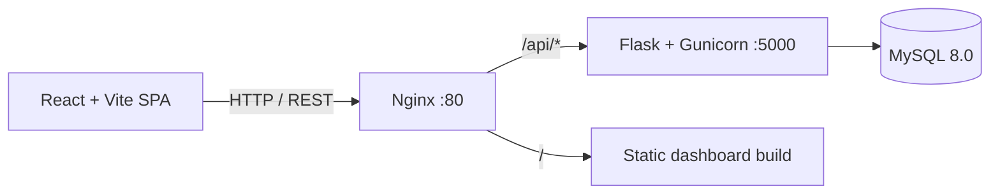
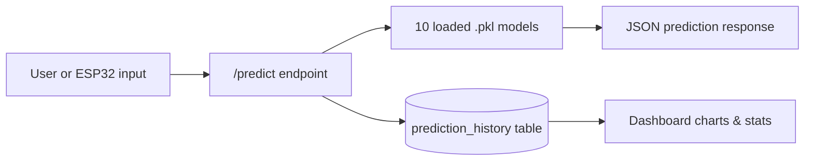
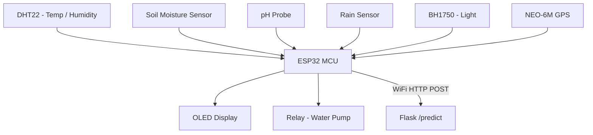

# 🌾 AgriSense — AI-Powered Precision Farming Platform

**An intelligent agriculture system combining Machine Learning, IoT sensor networks, and a modern web dashboard to help farmers make data-driven decisions.**

Built end-to-end by **Shruti Yadav** — from ML model training and REST API design to the React dashboard and ESP32 firmware.

        

---

## 📸 Application Screenshots

### AI Prediction Dashboard



### Admin Dashboard



### Reports & Analytics



### Prediction History



### Settings




---

## Table of Contents

- [Why I Built This](#why-i-built-this)
- [Features](#features)
- [System Architecture](#system-architecture)
- [Tech Stack](#tech-stack)
- [Folder Structure](#folder-structure)
- [Getting Started](#getting-started)
- [API Reference](#api-reference)
- [ML Models](#ml-models)
- [Database Design](#database-design)
- [Hardware (ESP32)](#hardware-esp32)
- [Testing](#testing)
- [Performance](#performance)
- [Roadmap](#roadmap)
- [About Me](#about-me)
- [License](#license)

---

## Why I Built This

Farming decisions in most regions are still made on intuition — when to irrigate, what to plant, how much fertilizer to use — even though climate variability, soil degradation, and water scarcity make those calls harder every season. I wanted to see whether a single, unified ML pipeline could actually replace ten separate "gut calls" with data-backed answers, and whether that pipeline could run cheaply enough on real hardware (an ESP32, not a server farm) to make sense for a smallholder farm.

That question turned into AgriSense: a Flask + MySQL backend serving **10 machine learning models** behind one API call, a React dashboard for visualizing trends, and ESP32 firmware for pulling live soil/weather data straight from the field.

| Problem | How AgriSense Addresses It |
|---|---|
| Farmers don't know which crop suits their soil/climate | Recommends the best-fit crop from live sensor + weather input |
| Yield is unpredictable until harvest | Regresses expected yield (kg/hectare) with a confidence score |
| Crop disease is caught too late | Flags disease risk from environmental patterns, before visible symptoms |
| Irrigation is guesswork | Classifies whether/when to irrigate based on real soil moisture |
| Soil health erodes silently | Scores soil condition and recommends corrective fertilizer |
| No historical record to learn from | Logs every prediction with a full audit trail and CSV/Excel export |

**Who it's for:** farmers wanting actionable recommendations, agri-researchers analyzing prediction trends, and IoT/ML developers looking for a reference architecture that connects real sensors to a real ML pipeline.

---

## Features

### Machine Learning
- **10 models in one inference call** — crop recommendation, yield prediction, disease detection, heat stress, soil health, fertilizer recommendation, irrigation decision, irrigation timing, rain impact, and farm efficiency rating
- **Confidence scoring** on every prediction, not just a bare label
- All models are `RandomForest` (9 classifiers + 1 regressor), trained via dedicated scripts in `training/`

### Dashboard
- Animated live stat cards (yield, irrigation status, soil health, efficiency, heat stress, rain impact)
- Chart.js trend visualizations — yield over time, crop distribution, disease breakdown
- Searchable, filterable, paginated prediction history (by region, crop, disease, date range)
- Glassmorphism UI with dark/light theme, fully responsive

### Data Layer
- MySQL 8.0 / InnoDB, 5 normalized tables with FK constraints and cascade rules
- Indexed on the columns that actually get queried (user, region, crop, prediction time, disease)
- Automatic audit logging on every user action

### Weather
- Live weather + 5-day/3-hour forecast via OpenWeatherMap, cached to cut down on API calls
- Prediction inputs are automatically enriched with current weather context

### Reports
- CSV (UTF-8 BOM), Excel (`openpyxl`), and print-to-PDF export of prediction history

### Auth & Security
- JWT auth (24h expiry), bcrypt-hashed passwords, role-based access (`admin` / `user`)
- Every auth event written to the audit log

### Hardware Integration
- ESP32 firmware reading live soil/weather sensors, posting straight to the Flask API
- Auto-irrigation relay control triggered by soil moisture thresholds
- OLED readout on-device, offline buffering with retry when WiFi drops

### Notifications & Analytics
- Browser + in-app alerts for heat stress, rain impact, disease, and irrigation events
- Admin view: system-wide metrics, DB size, crop distribution, 7-day prediction volume, average confidence

---

## System Architecture

**Request flow — browser to database**



**Prediction pipeline**



**ESP32 sensor node**



> If diagrams above don't render in your viewer, they're standard Mermaid flowcharts — GitHub, VS Code, and most markdown previewers support them natively.

---

## Tech Stack

| Layer | Technologies |
|---|---|
| **Frontend** | Vite 6, React 19, Tailwind CSS 4, Chart.js, lucide-react |
| **Backend** | Python 3.11+, Flask 3.1.1, Flask-CORS, Flask-Bcrypt, Flask-JWT-Extended, Gunicorn |
| **Database** | MySQL 8.0 (InnoDB), 5-table schema |
| **ML** | scikit-learn 1.6.1, joblib, pandas, numpy |
| **Hardware** | ESP32, DHT22, capacitive soil moisture, analog pH probe, rain sensor, BH1750, NEO-6M GPS, SSD1306 OLED, relay |
| **Deployment** | Docker Compose, Nginx, PlatformIO (firmware) |

---

## Folder Structure

```
smart-agriculture/
├── backend/            # Flask API, DB manager, 84 unit tests
├── dashboard/           # React + Vite frontend (js/, css/ modules)
├── model/               # 10 trained .pkl models + label encoders
├── training/             # One training script per model + cross-validation
├── prediction/           # Standalone inference scripts
├── data/                 # Datasets (CSV)
├── process/              # Data cleaning / feature engineering
├── report/               # Model evaluation (accuracy, R², confusion matrix)
├── database/             # schema.sql + backup utility
├── esp32/                # PlatformIO firmware (main.cpp)
├── docker-compose.yml    # MySQL + backend + nginx orchestration
├── Dockerfile
├── nginx.conf
├── requirements.txt
└── README.md
```

---

## Getting Started

### Prerequisites
- Python 3.9+, Node.js 18+, MySQL 8.0+, Git
- Optional: Docker & Docker Compose, PlatformIO (for ESP32 firmware)

### 1. Clone & set up the backend

```bash
git clone https://github.com/yadavshruti6/smart-agriculture.git
cd smart-agriculture

python -m venv venv
source venv/bin/activate      # Windows: .\venv\Scripts\Activate.ps1

pip install -r requirements.txt

cp .env.example .env          # add MySQL credentials + API keys
mysql -u root -p < database/schema.sql

python backend/app.py
```

### 2. Set up the frontend

```bash
cd dashboard
npm install
npm run dev
```

### 3. (Optional) One-command Docker deployment

```bash
cp .env.example .env
docker-compose up -d
docker-compose logs -f
```

This spins up three containers: `db` (MySQL, port 3307→3306), `backend` (Flask + Gunicorn), and `frontend` (Nginx serving the built dashboard + proxying `/api/`).

### 4. (Optional) Flash the ESP32

```bash
cd esp32
platformio run --target upload
platformio device monitor
```
Edit `esp32/src/main.cpp` for WiFi credentials, backend IP, and sensor calibration before flashing.

---

## API Reference

All responses are JSON. Protected routes require an `Authorization: Bearer <jwt_token>` header.

**Auth**
- `POST /auth/register` — create an account
- `POST /auth/login` — returns a JWT
- `GET /auth/me` — current user profile

**Prediction**
- `POST /predict` — runs all 10 models on one payload (region, soil moisture, pH, temperature, rainfall, humidity, sunlight, irrigation/fertilizer type, pesticide usage, days, lat/lon, NDVI) and returns crop recommendation, yield, disease status, heat stress, soil health, fertilizer, irrigation decision/timing, rain impact, farm efficiency, and a confidence score.

**Dashboard & History**
- `GET /health` — service + DB + model-load status
- `GET /dashboard/stats` — aggregate metrics, crop distribution, daily trend
- `GET /history` — paginated, filterable prediction history
- `GET /history/meta` — available filter values
- `DELETE /history/<id>` — remove a record

**Weather**
- `GET /weather/current?lat=&lon=`
- `GET /weather/forecast?lat=&lon=`

**Reports**
- `GET /export/csv`
- `GET /export/excel`

> Full request/response examples for every endpoint are documented inline in `backend/app.py`.

---

## ML Models

All 10 models are `RandomForestClassifier` / `RandomForestRegressor` from scikit-learn, trained on engineered soil-climate-crop feature sets and serialized with `joblib`.

| Model | Type | Output |
|---|---|---|
| Crop Recommendation | Classifier | Best-fit crop |
| Yield Prediction | Regressor | kg/hectare |
| Disease Detection | Classifier | Disease status |
| Heat Stress | Classifier | Low / Medium / High |
| Soil Health | Classifier | Excellent → Poor |
| Fertilizer Recommendation | Classifier | Fertilizer type |
| Irrigation Decision | Classifier | Start / No irrigation |
| Irrigation Timing | Classifier | Best time-of-day |
| Rain Impact | Classifier | Low / Medium / High |
| Farm Efficiency | Classifier | Excellent → Poor |

Retraining: drop a new dataset in `data/`, adjust the relevant script in `training/`, and re-run — `report/model_evaluation.py` gives accuracy, R², and confusion matrices for comparison against the existing `.pkl`.

---

## Database Design

5 tables, InnoDB, `utf8mb4`:

- **users** — auth + profile
- **prediction_history** — every ML run with its full input + output payload
- **user_settings** — theme, language, units, notification preferences (1:1 with users)
- **weather_cache** — OpenWeatherMap responses keyed by lat/lon
- **audit_logs** — JSON-detailed action log with IP, tied to users

Foreign keys use `ON DELETE CASCADE` for `user_settings` and `ON DELETE SET NULL` for `prediction_history`/`audit_logs`, so deleting a user doesn't silently wipe historical prediction data.

---

## Hardware (ESP32)

| Sensor | Measures | Interface |
|---|---|---|
| DHT22 | Temperature, humidity | 1-Wire |
| Capacitive soil moisture | Soil moisture % | Analog |
| Analog pH probe | Soil pH | Analog |
| Rain sensor | Rain detected (0/1) | Digital |
| BH1750 | Ambient light | I²C |
| NEO-6M | GPS lat/lon | UART |
| SSD1306 | On-device display | I²C |
| Relay | Pump control | GPIO |

Firmware supports three modes — **Online** (live upload every N seconds), **Offline** (buffers locally, retries on reconnect), and **Dummy** (simulated data for testing without hardware).

---

## Testing

| Suite | File | Count | Notes |
|---|---|---|---|
| Unit tests | `backend/test_all.py` | 84 | Fully mocked, no external deps |
| Legacy unit test | `backend/test_predict_endpoint.py` | 1 | Uses real models |
| Integration tests | `test_comprehensive.py` | 20 | Requires a running Flask server |
| Smoke test | `test_api.py` | 1 | Ad-hoc |

```bash
python -m backend.test_all -v
```

Coverage spans health checks, auth flows, prediction edge cases, history filtering/pagination, dashboard stats, weather proxy failures, export generation, and graceful degradation when MySQL is unreachable (every DB-dependent route returns a clean `503` rather than crashing).

---

## Performance

| Metric | Value |
|---|---|
| Prediction latency (all 10 models) | < 500 ms |
| Throughput | ~100 req/s (Flask + Gunicorn, 4 workers) |
| Model load time at startup | ~3 s for 10 `.pkl` files |
| Frontend bundle size | ~250 KB (Vite production build) |

---

## Roadmap

- ✅ Core API, 10-model pipeline, MySQL schema, React dashboard, JWT auth, ESP32 firmware, Docker deployment, 84-test suite
- 🚧 WebSocket live sensor streaming, i18n, PWA support, CI/CD via GitHub Actions
- 📋 Satellite NDVI integration, drone-based pest detection, WhatsApp/SMS alerts, retraining pipeline

---

## About Me

**Shruti Yadav**
B.Tech, IIIT Kota

- College Email: [2023kuec2061@iiitkota.ac.in](mailto:2023kuec2061@iiitkota.ac.in)
- Personal Email: [shrutiyadav7533@gmail.com](mailto:shrutiyadav7533@gmail.com)
- LinkedIn: [linkedin.com/in/shruti-yadav-57108a2a3](https://linkedin.com/in/shruti-yadav-57108a2a3)
- GitHub: [github.com/yadavshruti6](https://github.com/yadavshruti6)

I designed and built every layer of AgriSense myself — the ML training pipeline, the Flask API, the database schema, the React dashboard, and the ESP32 firmware — as a way to go deep on how ML models actually get deployed and consumed in a real, hardware-connected system rather than staying in a notebook. Feedback and PRs are welcome.

---

## License

Distributed under the MIT License. See [`LICENSE`](./LICENSE) for details.

Copyright © 2026 Shruti Yadav

---

<div align="center">

🌾 **Built for sustainable, data-driven agriculture.**

</div>